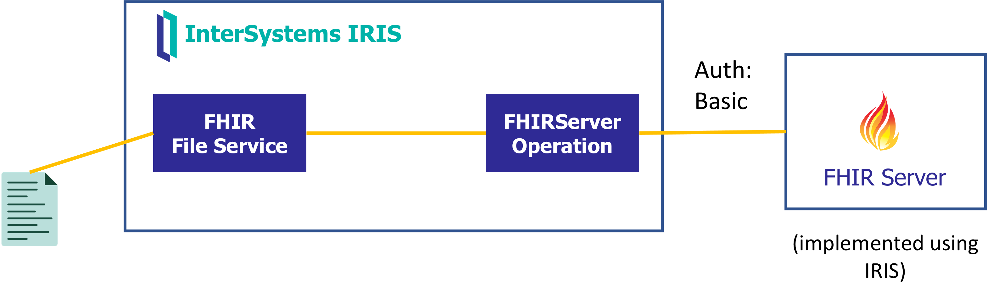
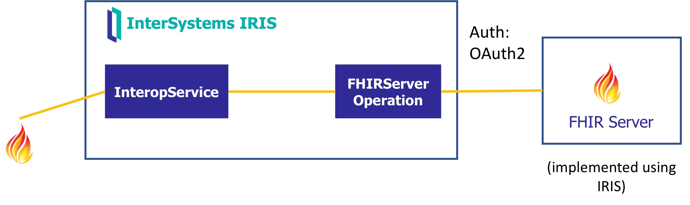

Example of using InterSystems IRIS or HealthShare Health Connect interoperability features for FHIR. Scenarios where forwarding requests and handling responses are required.

# Setup

Main setup components are:
* **FHIRREPO** - namespace with a FHIR repository (OAuth enabled) that will be used to simulate an external FHIR repo.
* **Apache + Webgateway** - webserver + webgateway to enable local https using self-signed certificates.
* **FHIINTEROP** - namespace that will run interoperability productions using FHIR Adapter.


Build image
```
docker-compose build
```

Run container
```
docker-compose up -d
```

## Modify your local hosts file 
Modify your hosts file to resolve `webserver` hostname to 127.0.0.1
```
127.0.0.1 webserver
```

You can find your hosts file in:
| O.S. | File |
| --------- | ----------- |
| MacOS | `/private/etc/hosts` |
| Windows | `c:\Windows\System32\Drivers\etc\hosts` |

Access IRIS instance using `superuser` / `SYS`:
https://webserver/iris/csp/sys/UtilHome.csp

## 1-Create Interoperability namespace

Open a [WebTerminal](http://localhost:52773/iris/terminal/) session.

### Create FHIRINTEROP namespace for interoperability:

```
zn "HSLIB"
do ##class(HS.Util.Installer.Foundation).Install("FHIRINTEROP")
```

### Load source code
```
zn "FHIRINTEROP"
do $SYSTEM.OBJ.LoadDir("/app/src/", "ck", .errorlog, 1)
```

## 2-Create FHIR Repository
Create a FHIR server in InterSystems IRIS. You will be using this as an external FHIR server.

### Create FHIRREPO namespace for fhir repository
```
zn "HSLIB"
 do ##class(HS.Util.Installer.Foundation).Install("FHIRREPO")
```

### Create FHIR endpoint
Create FHIR server in Health > FHIRREPO > FHIR Configuration > Server Configuration as:
* Endpoint: `/csp/healthshare/fhirrepo/fhir/r4`
* Core FHIR package: `hl7.fhir.r4.core@4.0.1`

### Create OAuth2 Server
```
zn "FHIRINTEROP"
do ##class(interop.util.Auth).CreateOAuth2Server()
```

### Create OAuth2 Resource Server
Go to *System Administration > Security > OAuth 2.0 > Client > Create Server Description*
* Issuer endpoint: `https://webserver/iris/oauth2`
* SSL/TLS configuration: `ssl`
* Discover and Save

Go to *System Administration > Security > OAuth 2.0 > Client > Client Configurations > Create Client Configuration*:
* Application name: `fhirserver-resserver`
* Client name: `fhirserver oauth resource server`
* Client type: `Resource server`
* SSL/TLS configuration: `ssl`
* Dynamic Registration and Save

### Create OAuth2 Client configuration
* Go to *System Administration > Security > OAuth 2.0 > Client > Client Configurations > Create Client Configuration*:
* Application name: `client-app`
* Client name: `client-app`
* Client type: `Confidential`
* SSL/TLS configuration: `ssl`
* Client redirect URL:
  * Use TLS: `yes`
  * Hostname: `webserver`
  * Prefix: `iris`
* Required grant types: `Client credentials`
* Dynamic Registration and Save

### Create HTTP OAuth2.Issuer Service Registry 
```
zn "FHIRINTEROP"
do ##class(interop.util.Auth).CreateOAuth2IssuerServiceRegistry()
```

### Edit FHIR server
Health > FHIRREPO > FHIR Configuration > Server Configuration > Edit FHIR Server endpoint:
* OAuth Client Name: `fhirserver-resserver`
* Smart on FHIR Capabilites: `client-confidential-symmetric,client-confidential-asymmetric`

### Load simple FHIR data
Load some simple sample FHIR data into repo.

```
zn "FHIRREPO"
set sc = ##class(HS.FHIRServer.Tools.DataLoader).SubmitResourceFiles("/app/install/simple-fhir-data/","FHIRServer","/csp/healthshare/fhirrepo/fhir/r4")
```

# Scenario: FHIR client
Scenario where you need to build or manipulate some FHIR request and send it to an external FHIR server.



## Config URL for external FHIR server

### Create Basic Credentials
Interoperability > FHIRINTEROP > Configure > Credentials > New
* ID: `FHIRRepoBasic` 
* Username: `superuser`
* Password: `SYS`

### Create HTTP service (Basic)
In `FHIRINTEROP` namespace, go to Health > Service Registry and create a new service:
* Name: `external-fhirserver-basic`
* Service Type: `HTTP`
* SSL Configuration: `ssl`
* Host: `webserver`
* HTTPCredentialsConfig: `FHIRRepoBasic`
* URL: `/iris/csp/healthshare/fhirrepo/fhir/r4`

### Create HTTP service (OAuth)
In `FHIRINTEROP` namespace, go to Health > Service Registry and create a new service:
* Name: `external-fhirserver-oauth`
* Service Type: `HTTP`
* SSL Configuration: `ssl`
* Host: `webserver`
* URL: `/iris/csp/healthshare/fhirrepo/fhir/r4`

## Test interoperability production
Have a look at the [interop.Production](http://localhost:52773/csp/healthshare/fhirinterop/EnsPortal.ProductionConfig.zen?PRODUCTION=interop.Production) production:
* `interop.bs.FHIRFileService` - Business Service that reads a file and creates a `HS.FHIRServer.Interop.Request` message.
* `interop.bp.FileToFHIRService` - Business Process that prepare `HS.FHIRServer.Interop.Request` from service before sending to external FHIR server.
* `HS.FHIRServer.Interop.HTTPOperation` - built-in Business Operation that sends a FHIR request to an external FHIR server.

Run some tests:
* Start the production
* Copy `data/patient.json` into `data/fhir-input` to process a sample file in your production.

# Scenario: FHIR server pass-through

Scenario in which you need to receive FHIR requests and send them to an external server.

For example, in case you need to forward a FHIR request to an external server you can use simple FHIR Interoperability Adapter in InterSystems IRIS or HealthShare Health Connect.
You can find more information in [FHIR Interoperability Adapter](https://docs.intersystems.com/healthconnect20221/csp/docbook/DocBook.UI.Page.cls?KEY=HXFHIR_fhir_adapter).

## OAuth

Let's say that you need to forward FHIR requests to a FHIR server, including OAuth token:



### Install adapter
You need to install the FHIR interoperability adapter before using it in a namespace.
During the adapter installation it will create:
* A web application for your FHIR server endpoint.
* An `InteropService` and `InteropOperation` in your production.

Install the adapter:

```
zn "FHIRINTEROP"
set status = ##class(HS.FHIRServer.Installer).InteropAdapterConfig("/myendpoint/r4")
```

Update your production as needed

### Config InteropService
Change `InteropService` Target Config Name so it will send messages to `FHIRServer Operation OAuth` which sends messages to external FHIR server.

Test your service using [iris-fhir-interop.postman_collection.json](./iris-fhir-interop.postman_collection.json) Postman collection *FHIR Interop (OAuth)*


## Simple REST Service

As a variation from the last scenario, let's say that you need to send FHIR requests to a FHIR service, but you need to make handling on the requests or response: 


### Create HTTP service (OAuth)
In `FHIRINTEROP` namespace, go to Health > Service Registry and create a new service:
* Name: `external-simple-service`
* Service Type: `HTTP`
* Host: `localhost`
* Port: 52773
* URL: `/csp/external/ServiceRequest`

### Change InteropService target
Change `InteropService` target so it will send requests to `interop.bp.SimpleServiceFHIRHandler`.

Now, test your service using [iris-fhir-interop.postman_collection.json](./iris-fhir-interop.postman_collection.json) Postman collection *FHIR Interop (Simple Service)*
